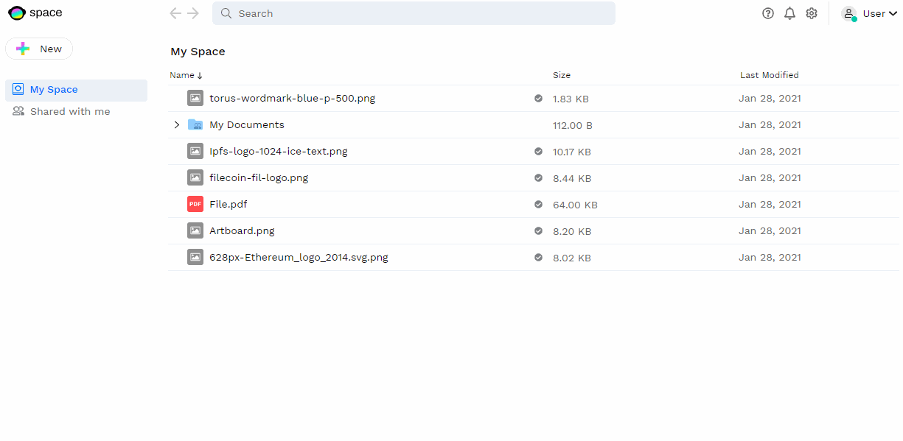

# Adjusting Settings

In Space account you can find basic configurations that allow you to personalize or better protect your account. Currently, in Space's closed beta, there are few configuration options available. As we move forward with the Open Beta releases, you will find more settings available related to notifications, privacy, storage, and billing.

## Adding Alternative / Backup Sign In Options

Space is a passwordless platform. As such, there is no concept of "password recovery". Therefore, it is very important that you ensure  you have an alternative / backup to your primary Sign In method, in case you get locked out of the email, social, or Gmail account linked to your Space.

You can do so by accessing your account's settings and **linking a new account** to your Space account. You can choose between the same alternatives provided when you chose your primary option.

## Changing Your Profile Picture and Display Name

You can give your account a more personal look by adding a new profile picture and display name. Click into your account's profile on the top right, and there you can edit these settings. By default, people who you share and accept files from will be able to see your account's name and picture.

You can change this by adjusting your name and picture **privacy settings** so that nobody, not even those who you share with, can see your picture or display name.