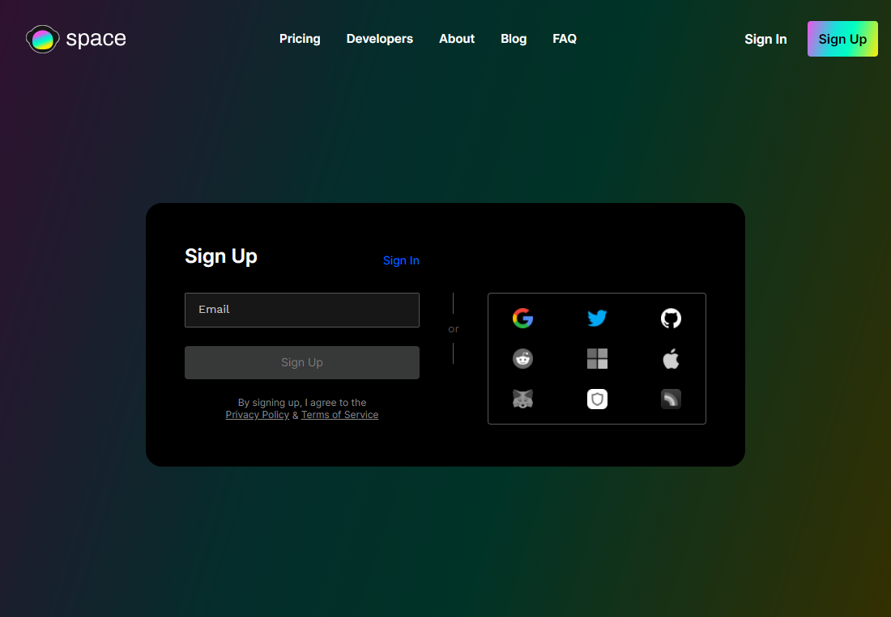
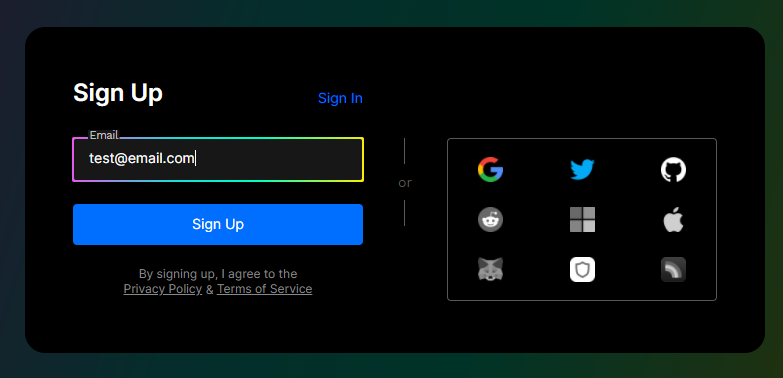
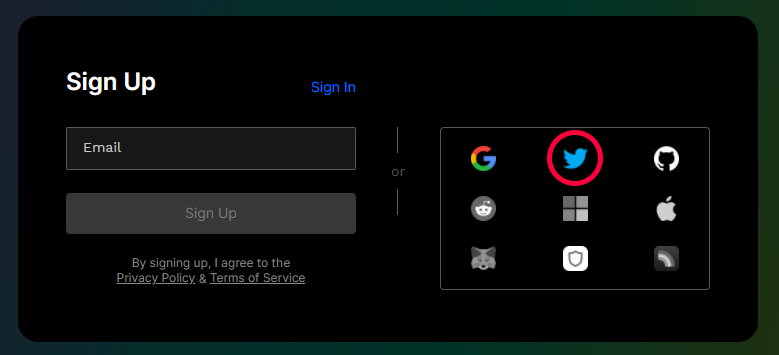
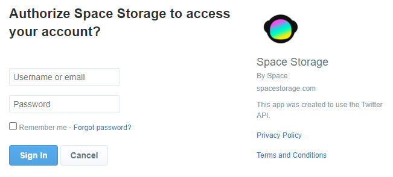
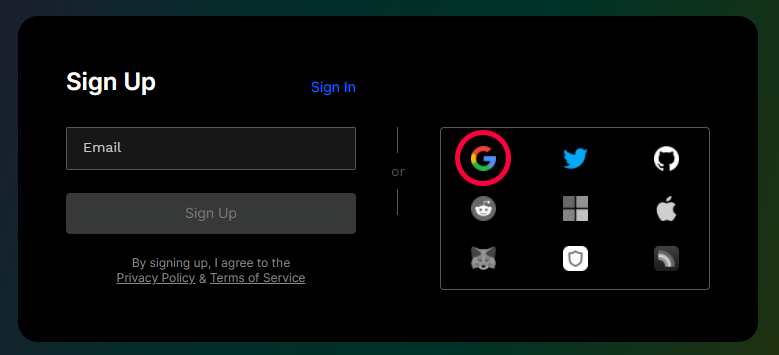
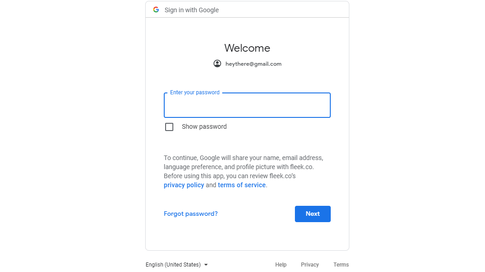

# Creating an Account

Accounts in Space are user-owned. Why? Because each account in Space is tied to an Ethereum key, that is kept only by the user, and ensures the center piece of the account doesn't live in Space, but decentralized on Ethereum!

Sounds too complicated? Don't worry, creating an account in Space is as simple as using any other online platform. When you sign up, you can choose between social logins you already know and love, like Twitter or Gmail, or passwordless email (sign in with magic links!). 

Soon you will also see crypto wallets added and more social methods enabled by Torus.

## Torus-enabled options and Crypto Wallets

This sign-in methods all abstract the need to manage your ETH key using a wallet thanks to the [Torus](https://tor.us/) protocol. We implemented Torus as a sign-in provider because it takes familiar flows (like signing up with Twitter!) and uses them to manage your keys in a seamless way. 

When you sign in, you are authenticated against the decentralized Torus network using Twitter, for example, and when Torus verifies your identity it fetches and gives you your encrypted keys back which you can use to access your Space account and storage. Trustless and decentralized, but familiar, safe, and convenient.

We are going to add crypto wallets as a sign in / sign up high privacy alternative, where users can choose to manage their account's Ethereum keys themselves, instead of relying on Torus.

## Creating an account

### With Email (Magic Links)

Creating an account with using any email address is quick and easy! In the sign up window, enter an email on the field to the left, and click Sign Up. That's it, really! We use passwordless accounts, meaning you will receive an email to the address you specified to access your account. Check your email, click the magic link, and you're in. 

If you sign out and want to get back in, the flow is exactly the same. When you visit the sign in page, you will need to enter your email again to receive a new magic link that will give you access to your account.

### With Twitter

To use a Twitter account as your Space sign-in, click the Twitter icon on the Sign up page, and wait for Twitter's authentication window to appear. 

You will be prompted to sign in and allow Space to be linked to your Twitter account. Once you do that, you will be done and your account will be ready. 

Anytime you want to log into your account, you will use your Twitter to authenticate back in. If your Twitter account is **already open on your browser**, you won't have to enter your credentials again.

### With Gmail

To use a Gmail account as a single-sign-on for creating and accessing your Space account, click the Gmail icon on the sign up page and an authentication window will appear.

If your Gmail account is already open on your browser, it will offer you the option to automatically use that for Space. If not, you will have to sign into your Gmail account. Once you do that, you will be redirected to the app and your Space account will be ready to use! **Need to sign back in?** Follow the same process in the sign in page.
