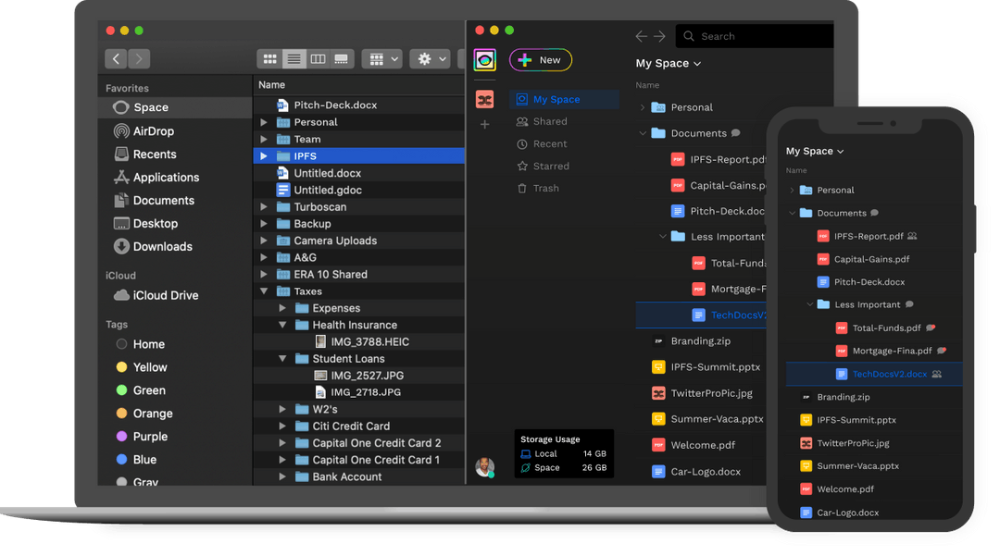

# Overview

Welcome to Space! Unlike storing and sharing files on the cloud, Space is a user-controlled and encrypted space. Meaning only you, not us, have access to your files, account, and storage. Take back control of your files and privacy by taking them to the Open Web.

!!! info

    Space is an open source community endeavor, developed by the team at Fleek. The platform's code is open for review, and developers are welcome to collaborate, or share with the team. Check out our [Github](https://github.com/FleekHQ)!

### Getting Started

Get started by setting up your account, and getting your first file to Space.

<a href="https://help.space.storage/getting-started/creating-account/" class="prev-box">
<h5>Creating an Account</h5>

With familiar or high privacy options

</a>
<a href="https://help.space.storage/getting-started/uploading-files/" class="prev-box">
<h5>Uploading Files</h5>

Store files and folders in Space

</a>
<a href="https://help.space.storage/getting-started/sharing-files/" class="prev-box">
<h5>Sharing Files</h5>

Share privately, or with public links

</a>
<a href="https://help.space.storage/getting-started/adjusting-settings/" class="prev-box">
<h5>Adjusting Settings</h5>

Personalize your account

</a>

