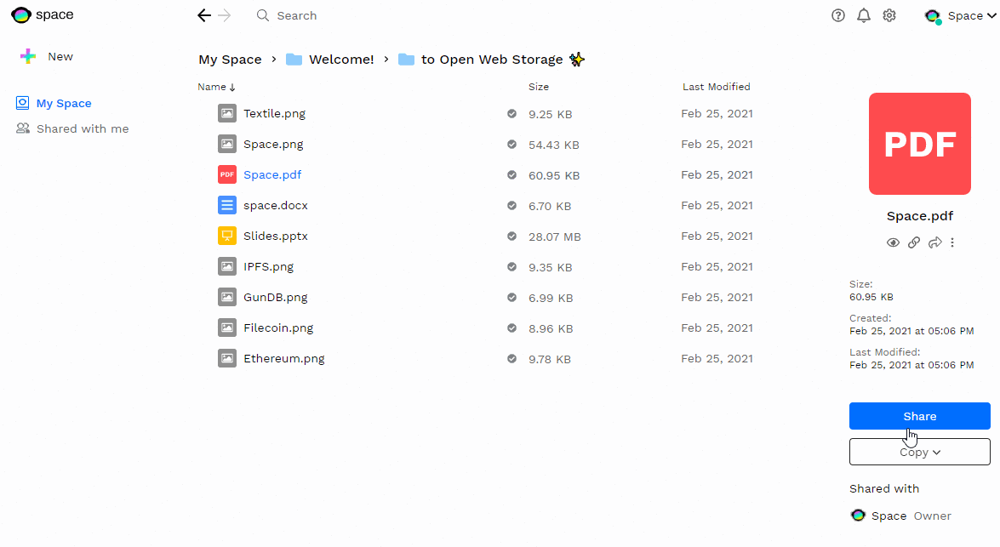
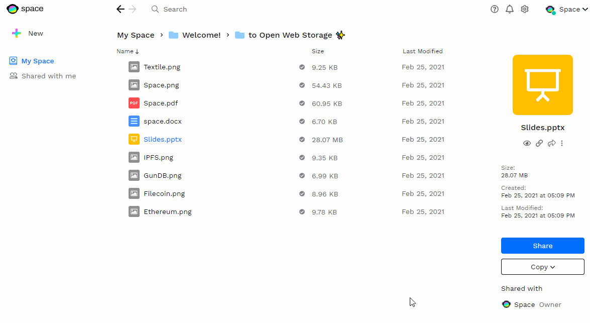

# Sharing Files in Space

After uploading files in Space, you can share them securely with whoever you want! Share them with other Space users, using any of the many possible username or address options users have when signing up.

!!! info

    Currently you can share files using email to specify the users and non-user you want to share your file with. Soon, we will add support for identifying the people you want to share with 

File sharing has two main categories: **private file sharing, and public file sharing.**

## Private File Sharing
### Sending Files via Email

When it comes to sharing file privately, users can send invites via the methods mentioned above to other users, or non-users when it comes to email.

When you share a file privately with someone, it is done in a safe and end-to-end encrypted way. That user will be given access to view, and decrypt **that specific file only** and you can revoke access anytime.}

### Sending Files via Private Link
Alternatively, you can invite users to your file and share a private link (seen above), which only they can access. This way you can control who has access to the private link itself.

If you see the image , it is set to **Only people invited**. If you click on that downward facing arrow, you will prompt a toggle to enable a public link. See below for more information on public link sharing.

## Public File Sharing
### Using Public Links

Files can be made public using public links. When made public, a file will remain decrypted and the file's public URL will be accessible for anyone to view, download, or share. Public files **can be turned back to private**.

