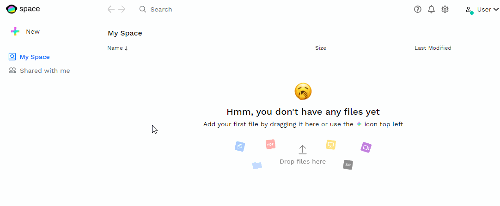
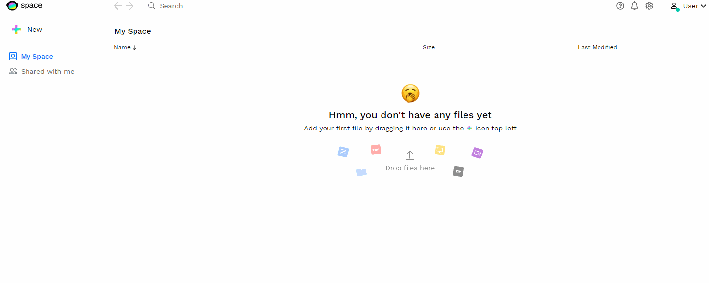
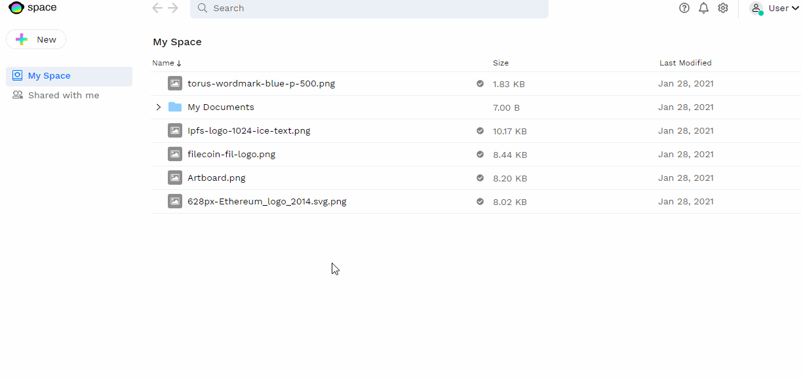
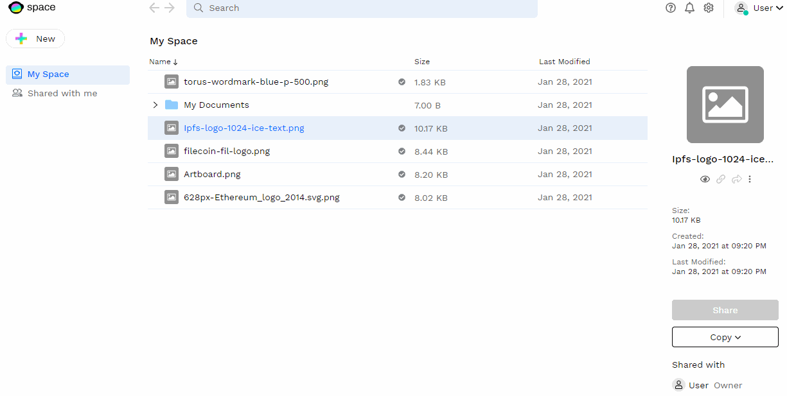

# Uploading Files to Space

In Space, when you upload a file it is stored on distributed Space nodes (running on IPFS/Textile) that only you can access and decrypt. Aside from that first layer of storage, all files are backed up redundantly on [Filecoin](https://filecoin.io/), a decentralized storage network.

Space allows you to:

- Upload one or multiple files.
- Upload folders / directories.
- Create folders in Space to organize files.

## Upload options
### Dropdown Menu
You can upload **one or multiple files at once**, or directly select directories to **upload entire folders** from your device to Space, using the "+ NEW" button on the top left of the application.

### Drag and Drop
Instead of using the **+** dropdown menu, you can also **drag and drop files** and folders directly into Space.

## File Details
### Information and Actions

If you click a file in Space, an individual bar will appear on the right hand bar where you'll see the file details, current shared users, and have access to the **preview and download buttons**. Some of these actions are also available if **you right click the file**.

!!! info

    Some of Space's action are greyed out during the initial phase of the Beta, and will be added shortly.

### IPFS Hash

In this details bar you can also find the file's IPFS hash. **The IPFS hash** represents the file's unique content identifier, as it is stored in the IPFS/Textile node. It represents its location by identifying its content, not its location.

