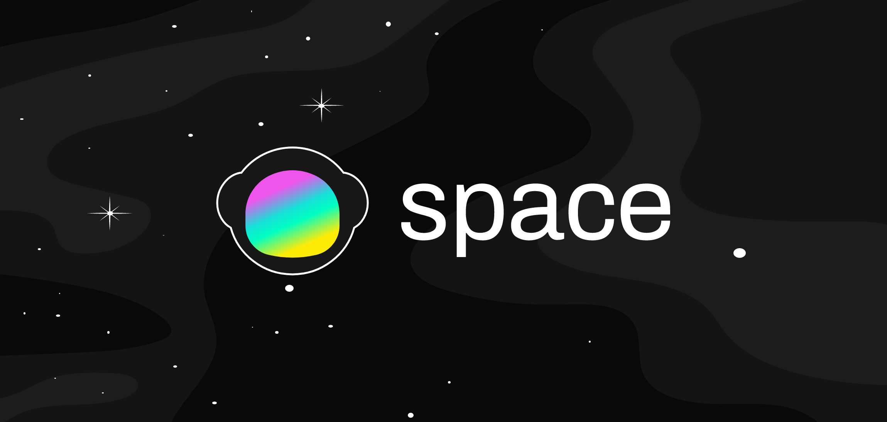

Welcome to Space's documentation. Here you can find quick tips on how to get started using our platform and insight on the platform's technical architecture. 

**Need support or have an idea to share?** talk to our team using the **pop-up chat window** to the right of the screen.

Space is an open-source, user-controlled, and encrypted platform for storing and sharing files. It is built using Open Web protocols like IPFS, Textile, Filecoin, GunDB, Ethereum, and Torus through the open source Space SDK library, built by us to and available for anyone that also wants to create applications or websites powered by the underlying protocols of the Open Web. Made by the team at [Fleek](https://fleek.co/).

In its first Beta release, Space is available as a **browser application**, accessible from any browser through our [Website](https://space.storage).

## Getting Started

Set up your Space account, upload your first file, learn how to share, and make the best out of a storage platform built so that control over your account, files, and privacy rests in your hands only.

!!! info

    The Space web application is currently a Beta release and represents the first public iteration of the platform. Feel free to reach out to us and share any feedback, ideas, bugs, or thoughts via our social media or our website's chat window, also present in this page.

<a href="./getting-started/creating-account/" class="prev-box">
<h5>Creating an Account</h5>

With familiar or high privacy options

</a>
<a href="./getting-started/uploading-files/" class="prev-box">
<h5>Uploading Files</h5>

Store files and folders in Space

</a>
<a href="./getting-started/sharing-files/" class="prev-box">
<h5>Sharing Files</h5>

Share privately, or with public links

</a>
<a href="./getting-started/adjusting-settings/" class="prev-box">
<h5>Adjusting Settings</h5>

Personalize your account

</a>

## Protocol Stack Overview

Learn how we leverage the underlying protocols of the Open Web (IPFS, Filecoin, Textile GunDB, Torus, and Ethereum) to power features in Space like distributed and user-controlled storage, private file sharing, and user-owned accounts that are Ethereum-based.

<a href="./protocols-overview/overview/" class="prev-box">
<h5>Open Web Protocols in Space</h5>

Learn about our Open Web stack

</a>

## Space SDK

The Space web application is built using the Space SDK, a modular JS library that packages the IPFS, Textile, Filecoin, GunDB, and Torus implementations necessary to build Open Web apps into easy to use commands and interfaces. It's open source and designed as a tool that anyone can plug into their websites or applications and implement Web3-enabled functionalities to make their projects more trustless and user-controlled. 

It's the successor of the Space Daemon, our desktop-based library. The Space SDK take the perks of the Daemon (encryption, user-controlled storage, peer-to-peer interactions, etc.) and makes them available on browser and mobile experiences. It's modular, and protocol agnostic, meaning you can use our own implementations (Textile hub for users, for example) or plug in your own layer and still leverage the SDK as an interface to manage it.

<a href="./space-sdk/overview/#Introduction" class="prev-box">
<h5>Overview</h5>

Learn about the SDK

</a>
<a href="./space-sdk/overview/#currently-available-apis" class="prev-box">
<h5>Available Modules</h5>

View the current interfaces

</a>
<a href="./space-sdk/overview/#the-space-sdk-versus-the-space-daemon" class="prev-box">
<h5>Space SDK vs Space Daemon</h5>

What are the main differences?

</a>
<a href="./space-sdk/overview/#installing-the-space-sdk" class="prev-box">
<h5>Installing the Space SDK</h5>

How to get started with the SDK

</a>
<a href="./space-sdk/overview/#migrating-from-the-space-daemon" class="prev-box">
<h5>Migrating from Space Daemon</h5>

Learn the corresponding methods

</a>

## Space Daemon

The Space Daemon is a desktop-focused library that packages together IPFS, Textile Threads/Buckets, and Textile Powergate (Filecoin) into one easy to install and JS interface to make it easy to build peer to peer and privacy focused apps. 

Installing the Space Daemon is easy and comes with all the tools packaged together including IPFS and Textile nodes, and and also exposes gRPC methods specific to the features you want for your app including: 

File Upload (encrypted), File Sharing, Filecoin Markets, and User Controlled Data. You can access same methods using our JS client, so you don't need to worry about gRCP calls.

<a href="./space-daemon/getting-started/#installation" class="prev-box">
<h5>Daemon Installation</h5>

Install the Space Daemon

</a>
<a href="./space-daemon/getting-started/#crud-operations" class="prev-box">
<h5>Users API</h5>

Create and authenticate identities

</a>
<a href="./space-daemon/getting-started/#sharing" class="prev-box">
<h5>P2P Sharing</h5>

Integrate Sharing Files Peer to Peer

</a>

## Other Resources

Join our public [Slack](https://slack.fleek.co/), visit our [GitHub](https://github.com/FleekHQ), follow us on [Twitter](https://twitter.com/spacestorage), and check out the [Blog](https://blog.space.storage)!