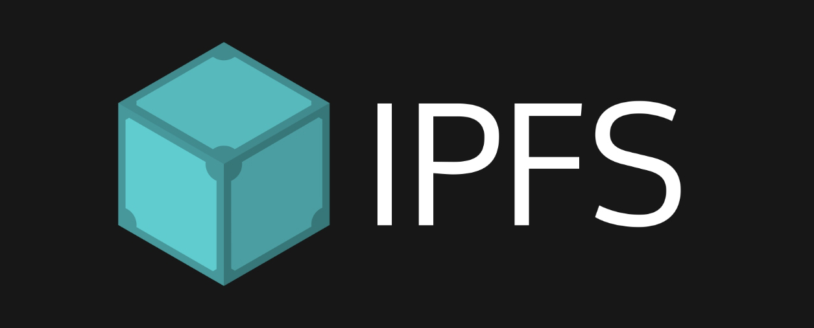
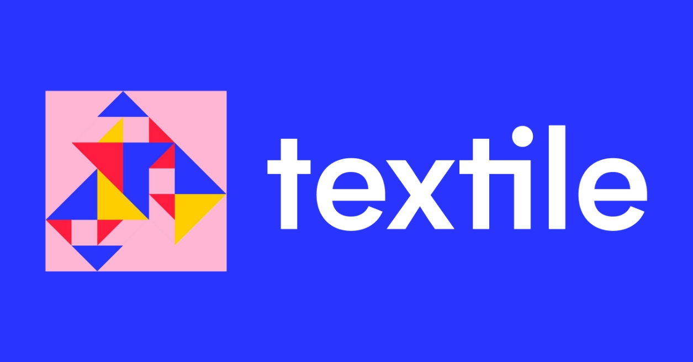
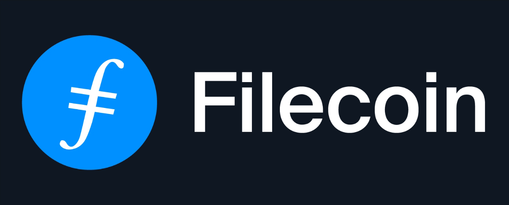
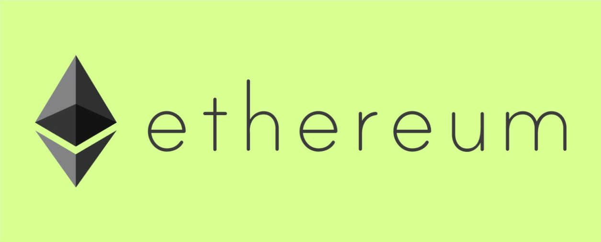

# The Protocols Behind Space

For Space, we are using an Open Web protocol stack that is ever-changing, and that allows us to rethink the storage paradigm. Instead of a corporation-centric storage platform, where users are guests, we can build what we believe is the next evolution of storage: user-owned, non-siloed, distributed, and open storage where users are in total control.

We abstract the complexities of these protocols to provide a familiar experience to what storage is today, but with the underlying perks of building on the Open Web stack:

- [IPFS](https://ipfs.io/)
- [Textile](http://textile.io/)
- [Filecoin](https://filecoin.io/)
- [Ethereum](https://ethereum.org/)
- [Torus](https://tor.us/)
- [GunDB](https://gun.eco/)

## IPFS, the Base Storage Layer

**What is IPFS?** The Interplanetary file system is a Web3 protocol built to provide a distributed and peer-to-peer network for data storage.

Each user on IPFS represents a node in a distributed network where their storage can be used in a participative way, and without central authorities.

**Space uses IPFS** as the base storage layer layer, enabled by Textile. It enables the use of distributed storage infrastructures with amazing features like content addressing via hashes that represent the file's content itself, not its location; or open storage networks based on peer-to-peer file transmission, which can enable us for example to offer local storage and p2p sharing on desktop.

## Textile, for Encryption and Synchronization

**What is Textile?** It's an infrastructure that build on top of IPFS to enable encrypted storage, folder management, data synchronization, and permission-based sharing of files and folders, which are not native concepts of IPFS.

The two main components of Textile are Buckets and Threads. Threads act as an append-only database of logs among peers on IPFS that is able to synchronize data across them. Buckets, on the other hand, enable dynamic folder systems and the management of those systems among peers.

**Space uses Textile** for storage primarily and user management. Buckets and Threads, combined with our own AES-256 encryption, allow us to give users an encrypted file management system on IPFS with sharing capabilities.

And as for users, we can use the Textile User API to initialize users in the remote Textile Hub instance and authenticate them against their storage in the network so that they can perform actions in it (store, share, etc).

## Filecoin, for Decentralized Backups

**What is Filecoin?** Filecoin is the evolution of IPFS, built by the same team at Protocol Labs. It is a decentralized and open storage network, like IPFS, but adds the incentive and economic layer that enables a decentralized storage economy among miners (storage) and users (people who need to store data).

Filecoin is part of the next steps in decentralizing storage entirely, by switching from centralized storage infrastructures to entirely decentralized ones that act as open storage networks, and are not platform-dependent like storage is today.

**How does Space use Filecoin?** In its current state, Space uses Filecoin as a backup and redundancy layer. All files that users store on Space are automatically backed up to the Filecoin decentralized storage network, to ensure they exist on a secondary layer that is not Space-dependent. IPFS/Textile acts as a primary and performance-focused storage layer, and Filecoin works as a cold storage layer due to its integrity and persistence guarantees. As we move forward, we intend to transition to an open storage network entirely.

## Torus for Seamless Key Management

**What is Torus?** Torus is an open source and decentralized key management system that abstracts the need to manually manage key-pairs, and provides non-custodial sign-in experiences on top of it such as social sign-ins and OAuth to make the key management process seamless as regular logins are today.

**How does Space use Torus?** We use it to provide our sign in / sign up options! It enables us to decentralize part of our authentication model and accounts out of our platform.

Users are assigned an Ethereum key-pair, unique to their account, and those keys are then sharded and stored in the decentralized Torus network. Instead of having to manage them manually **-users will be able to do so when we implement crypto wallets-**, Torus provides a familiar authentication experience to retrieve these keys from the network and use them to access Space:

- Email magic links
- Social sign-ins
- OAuth
- More!

This way, we can provide a future-proof account system (key-pair based), and tie it down to a seamless experience, that anyone coming from Web2 standards can access (using Twitter, Gmail, etc.)

More importantly, it helps us eliminate passwords all together! Replacing passwords for key pairs has proven to be the stronger alternative to a faulty system. And what better set of key pairs than Ethereum for this, for all the use cases it could enable?

## Ethereum, for Accounts, Payments, and More

**What is Ethereum?** It is a programmable blockchain with smart contract functionality, able to power decentralized applications and program interactions of value and action.

**What does Space use Ethereum for?** Ethereum keys are the main component of Space accounts. Why? Because we believe key-pairs, and Ethereum key-pairs specifically, are the future of authentication and that they open up the possibility to integrate an entire ecosystem for:

- Payments / transfers
- Dapp integrations / interactions
- Rethinking NFT user-ownership

And so on! One belief we have regarding the Open Web is that it should be interconnected, and able to interact with each other. Isolating from such a thriving environment such as Ethereum, and trying to rebuild the wheel for many decentralized use cases was simply not an option.

## GunDB, for Distributed Metadata & Key Storage

**What is GunDB?** Gun is a graph database sync protocol that works in any environment that supports JavaScript. It powers distributed databases in a p2p and decentralized way, synchronizing data in a user-controlled and secure way that natively supports encryption.

**What does Space use GunDB for?** In Space's web application, we have the need to store and sync a user's storage (bucket/thread) metadata and encryption keys. For the web application, secure local storage (using Textile threads) isn't available, and the alternative would be to rely on the remote Textile hub for this.

However, in this very specific scenario, we are dealing with sensible data. Meaning, if we were to use the Hub, we'd have to encrypt it and that would affect the querying and fetching. Gun easily solves this use case. 

We derive a Gun secure (encrypted) user from a Space user, and the metadata/keys are stored encrypted (for that specific user only) on a decentralized network that can sync in browser. Since the Gun key-pair is derived from the Space user itself, users only need to authenticate themselves on that layer to fetch, retrieve, and decrypt.